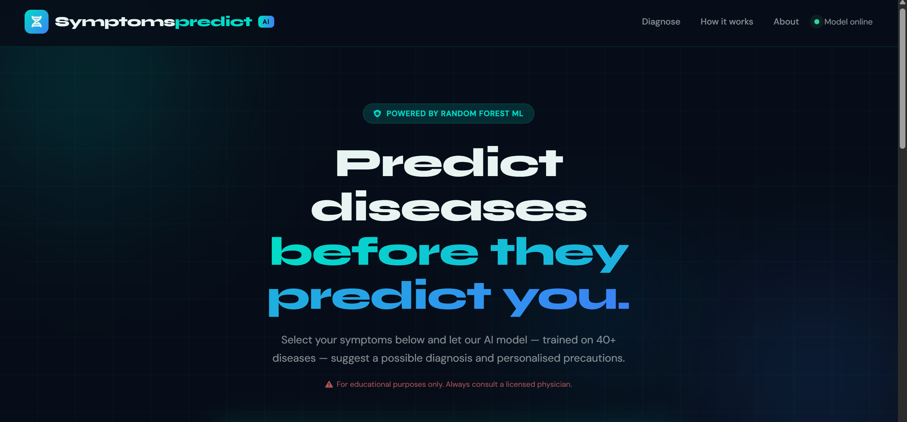
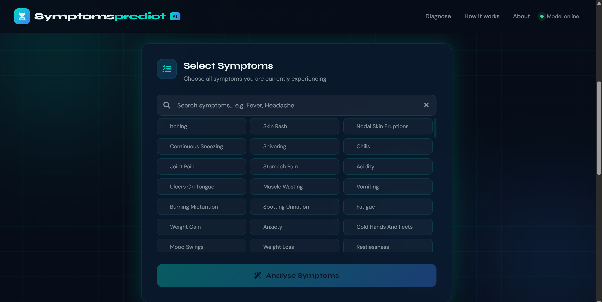
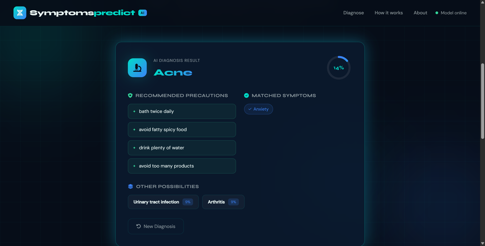

# 🩺 MediScan AI — Disease Prediction System

> AI-powered disease prediction platform that analyzes symptoms and predicts possible medical conditions using a Random Forest Machine Learning model.

🌐 **Live Demo:** http://diseases-prediction-lake.vercel.app/

---

## 📸 Application Preview

### Home Page



### Symptom Selection



### Disease Prediction Result



---

## 🎯 Project Overview

MediScan AI is a machine learning-based healthcare assistant designed to provide preliminary disease predictions based on user-reported symptoms.

The system allows users to select symptoms from a database of 130+ symptoms and uses a trained Random Forest classifier to predict the most probable disease along with personalized precaution recommendations.

⚠️ This application is intended for educational and research purposes only and should not replace professional medical consultation.

---

## 🚀 Features

### Intelligent Disease Prediction

* Predicts 40+ diseases
* Supports 130+ symptoms
* Random Forest ML Model
* Real-time prediction
* Confidence-based diagnosis

### User Experience

* Fast symptom search
* Responsive design
* Clean medical dashboard
* Mobile-friendly interface
* Instant analysis

### Healthcare Insights

* Disease prediction
* Precaution recommendations
* Symptom analysis
* Educational medical information

---

## 📊 Dataset Information

The model was trained on publicly available symptom-disease datasets containing:

* 40+ diseases
* 130+ symptoms
* Multi-class classification problem
* Structured symptom-to-disease mapping

### Sample Diseases

* Diabetes
* Dengue
* Malaria
* Typhoid
* Pneumonia
* Migraine
* Hypertension
* Gastroenteritis
* Hepatitis
* Chickenpox

and many more.

---

## 🧠 Machine Learning Pipeline

### Data Preprocessing

* Symptom Encoding
* Missing Value Handling
* Feature Transformation
* Binary Symptom Representation

### Model Training

The following algorithms were evaluated:

| Model               | Purpose     |
| ------------------- | ----------- |
| Logistic Regression | Baseline    |
| Decision Tree       | Comparison  |
| Random Forest       | Final Model |

### Selected Model

✅ Random Forest Classifier

Reasons:

* High Accuracy
* Robust Performance
* Handles Non-linearity
* Reduced Overfitting
* Feature Importance Support

---

## ⚙️ How It Works

### Step 1

Select symptoms from the available symptom list.

### Step 2

The symptoms are converted into machine-readable features.

### Step 3

The Random Forest model analyzes symptom patterns.

### Step 4

The system predicts the most likely disease.

### Step 5

Personalized precautions and recommendations are displayed.

---

## 🛠 Tech Stack

### Frontend

* HTML5
* CSS3
* JavaScript
* Vercel Deployment

### Backend

* Flask
* REST API

### Machine Learning

* Python
* Scikit-Learn
* Random Forest
* Pandas
* NumPy
* Joblib

---

## 📈 Business Impact

- Enables quick preliminary health assessments
- Demonstrates practical healthcare AI applications
- Reduces time required for symptom analysis
- Provides educational insights into disease prediction
- Showcases machine learning deployment in real-world scenarios

## 🔌 API Endpoint

### Predict Disease

```http
POST /predict
```

### Request

```json
{
  "symptoms": [
    "headache",
    "high_fever",
    "fatigue",
    "nausea"
  ]
}
```

### Response

```json
{
  "disease": "Dengue",
  "confidence": 92.4,
  "precautions": [
    "Stay hydrated",
    "Take adequate rest",
    "Monitor temperature",
    "Consult a physician"
  ]
}
```

---

## 📈 Project Highlights

✅ 40+ Diseases Supported

✅ 130+ Symptoms Covered

✅ Random Forest Classifier

✅ REST API Architecture

✅ Responsive UI

✅ Real-Time Predictions

✅ Healthcare Analytics

✅ Cloud Deployment

---

## 🎓 Skills Demonstrated

* Machine Learning
* Classification Models
* Healthcare Analytics
* Feature Engineering
* Data Preprocessing
* Flask API Development
* Frontend Development
* Deployment & MLOps

---

## 👨‍💻 Author

### Ritik Raushan

Machine Learning Engineer | Data Analyst | AI Enthusiast

* Python
* Machine Learning
* Data Science
* Full Stack AI Applications

⭐ If you found this project useful, consider giving it a star.
